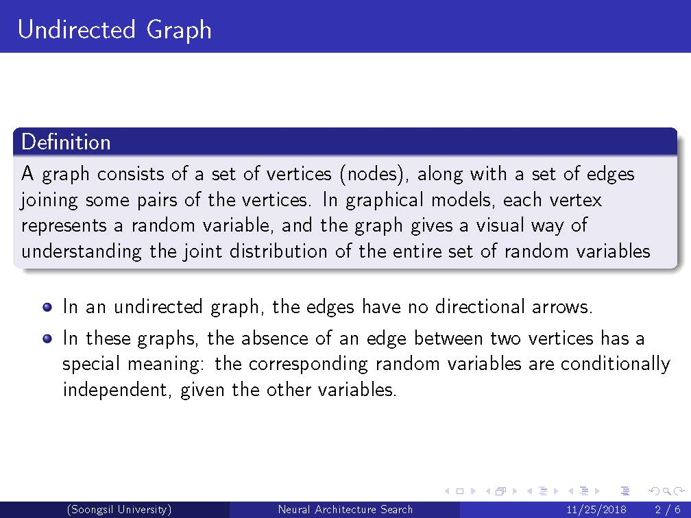
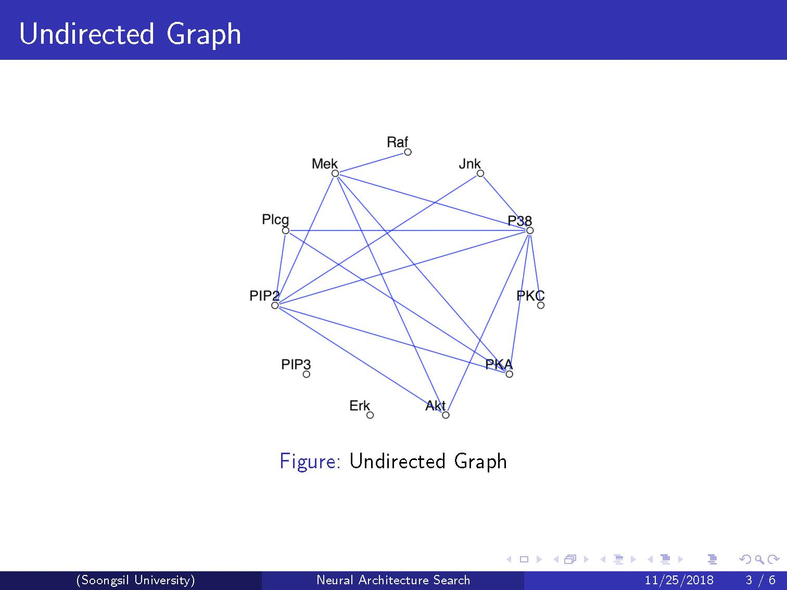
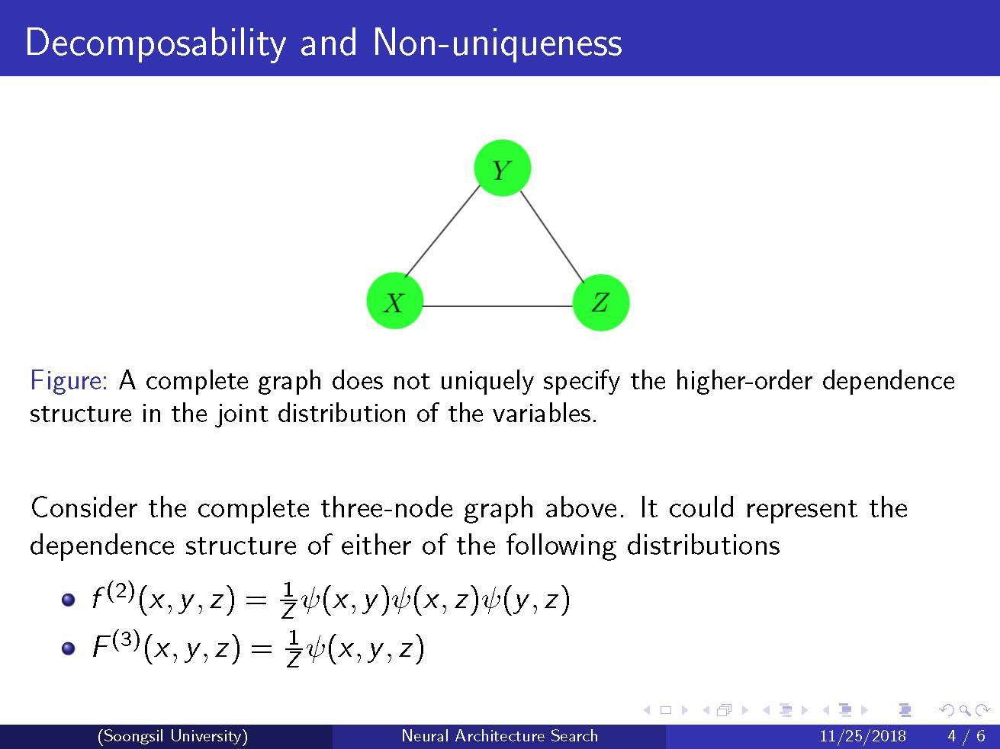
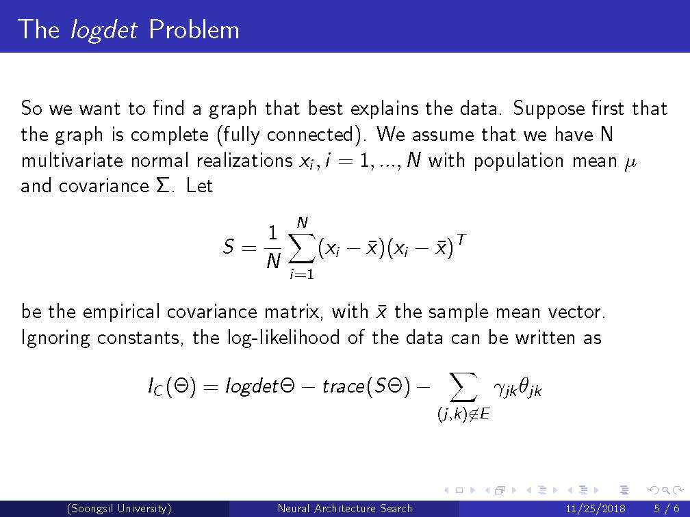
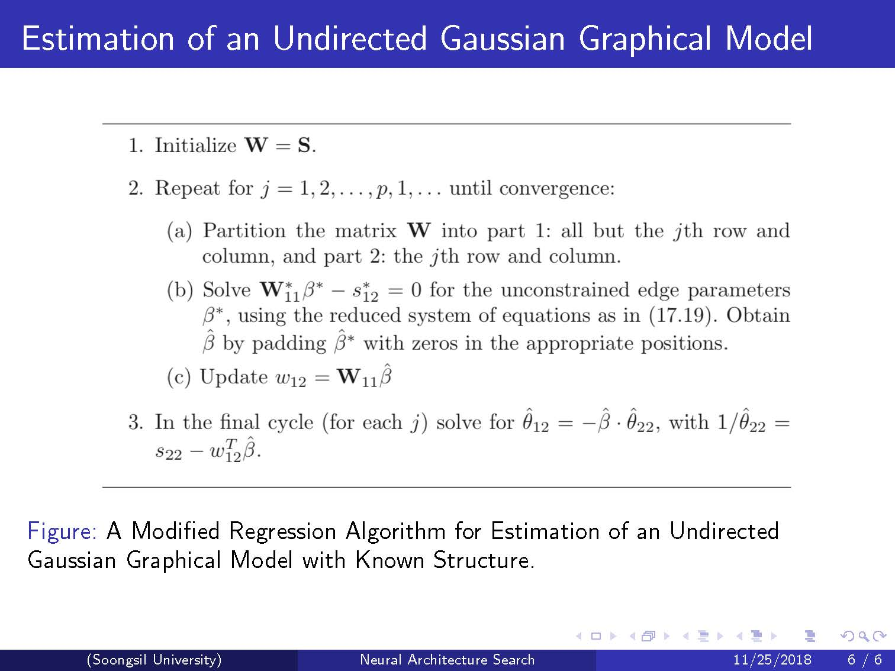
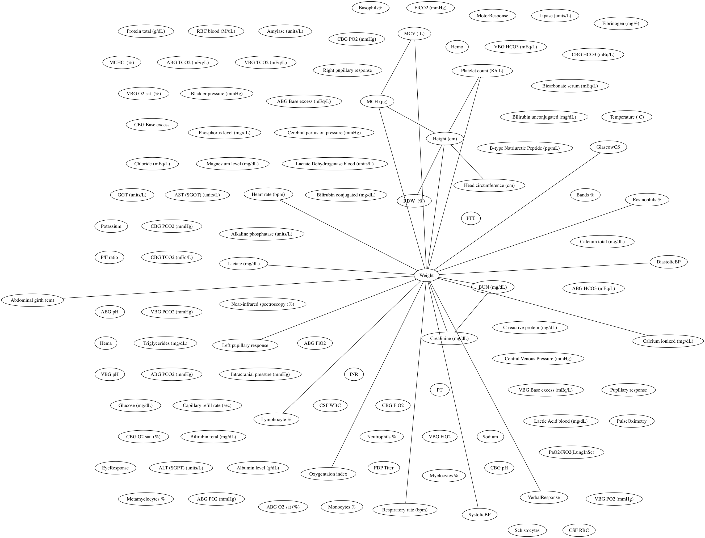
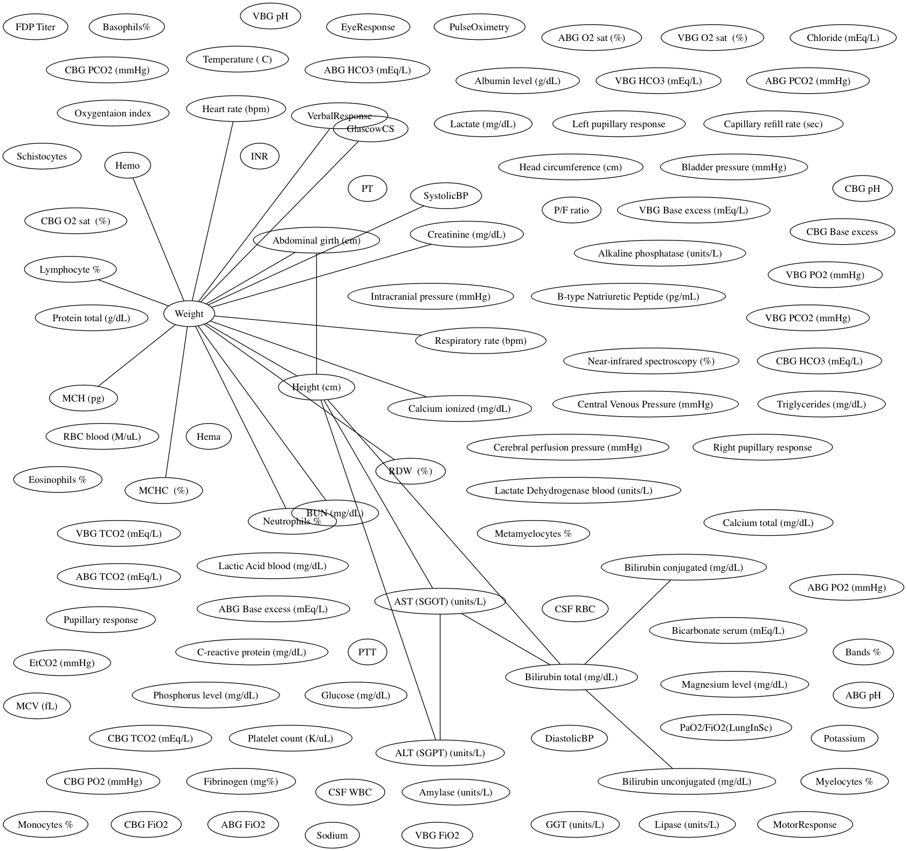

# Undirected Graphical Models

## Introduction

## Result
<figure>
  
  <figcaption>Figure1: Estimation result with lambda = 6.0</figcaption>
</figure>

<figure>
  
  <figcaption>Figure2: Estimation result with lambda = 7.0</figcaption>
</figure>
